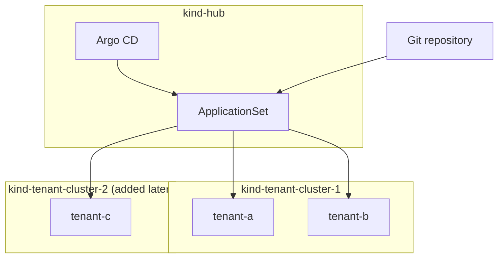

# Multi-tenant GitOps with Kind and Argo CD

A local demo of a hub-and-spoke GitOps setup:



Argo CD reads each tenant's configuration from Git and deploys its Kustomize
overlay to the selected spoke cluster. Spoke 1 is `kind-tenant-cluster-1`;
spoke 2 is `kind-tenant-cluster-2`.

## Prerequisites

```bash
brew install kind kubectl helm argocd
brew install --cask docker
```

Start Docker Desktop, then push this repository to a remote Git repository.
Argo CD must be able to read that repository.

```bash
git remote add origin https://github.com/YOUR_ORG/YOUR_REPO.git
git push -u origin main
```

## 1. Bootstrap the hub and first spoke

```bash
REPO_URL=https://github.com/YOUR_ORG/YOUR_REPO.git ./setup.sh
```

The script creates the hub, installs and logs in to Argo CD, creates spoke 1,
and registers it with the hub. It also applies the ApplicationSet, so
`tenant-a` and `tenant-b` deploy to spoke 1 automatically.

Open Argo CD at <https://localhost:8080>. The bootstrap output prints the
initial admin password.

## 2. Verify the first spoke

```bash
argocd cluster list
argocd app list

kubectl --context kind-tenant-cluster-1 get pods -n tenant-a
kubectl --context kind-tenant-cluster-1 get pods -n tenant-b
```

The applications should target:

```
https://tenant-cluster-1-control-plane:6443
```

The hub does not run tenant workloads.

For the end-to-end microservice workflow, see [Build an image and deploy it to
a tenant](docs/deploy.md), with diagrams covering CI → ECR and Git → Argo CD →
the selected spoke and tenant namespace.

## 3. Add the second spoke

Keep the Argo CD port-forward and CLI login created by `setup.sh` running,
then run:

```bash
./scripts/add-kind-spoke.sh tenant-cluster-2
```

The helper creates the Kind cluster when needed, creates the Argo CD service
account and RBAC, and registers the Docker-network API endpoint that is
reachable from the hub. Re-running it is safe.

## 4. Put tenant-c on the second spoke

```bash
mkdir -p tenants/tenant-c overlays/tenant-c
cp tenants/tenant-a/config.json tenants/tenant-c/config.json
cp overlays/tenant-a/kustomization.yaml overlays/tenant-c/kustomization.yaml
```

Edit `tenants/tenant-c/config.json`:

```json
{
  "tenant": "tenant-c",
  "namespace": "tenant-c",
  "clusterURL": "https://tenant-cluster-2-control-plane:6443",
  "clusterName": "kind-tenant-cluster-2"
}
```

Edit `overlays/tenant-c/kustomization.yaml` so its namespace, labels, and
resource names use `tenant-c`; set the desired image tag under `images[].newTag`
and replica count under `replicas[].count`. The tenant JSON selects the deployment
destination; the Kustomize overlay controls image versions and scaling.
Then commit and push:

```bash
git add tenants/tenant-c overlays/tenant-c
git commit -m "add tenant-c on spoke 2"
git push
```

Argo CD creates the `tenant-c` Application and deploys it to spoke 2.

```bash
argocd app get tenant-c
kubectl --context kind-tenant-cluster-2 get pods -n tenant-c
```

## Check nginx in your browser

Once the tenant pods are ready, run each port-forward in its own terminal.
Keep those terminals open while testing; port 8080 remains reserved for Argo CD.

```bash
# Tenant-a: http://localhost:8081
kubectl --context kind-tenant-cluster-1 -n tenant-a \
  port-forward svc/demo-app-tenant-a 8081:80

# Tenant-b: http://localhost:8082
kubectl --context kind-tenant-cluster-1 -n tenant-b \
  port-forward svc/demo-app-tenant-b 8082:80

# Tenant-c (after adding spoke 2): http://localhost:8083
kubectl --context kind-tenant-cluster-2 -n tenant-c \
  port-forward svc/demo-app-tenant-c 8083:80
```

Open the corresponding URL in your browser to see the nginx welcome page.
In another terminal, inspect the HTTP `Server` header to check the nginx version:

```bash
curl -sSI http://localhost:8081 | grep -i '^server:'
curl -sSI http://localhost:8082 | grep -i '^server:'
curl -sSI http://localhost:8083 | grep -i '^server:'
```

For example, tenant-a may return `Server: nginx/1.25.5`. The version should
match `images[].newTag` in the deployed tenant overlay. A customized nginx
configuration can hide the version from this header.

Press Ctrl+C in each port-forward terminal when finished.

Or you could just go to ArgoCD -> Applications -> tenant-c -> hover over pod
to see the deployed image version.

## Useful commands

```bash
# Render a tenant overlay locally
kubectl kustomize overlays/tenant-a

# Trigger a sync without waiting for the Git poll
argocd app sync tenant-c

# Remove the hub and every project spoke (`tenant-cluster-*`)
./teardown.sh --yes
```

## Local Kind networking

Kind writes `127.0.0.1:<port>` into your local kubeconfig. That address works
from your Mac, but not from Argo CD running inside the hub cluster. The helper
uses `https://<spoke>-control-plane:6443`, the shared Docker-network address,
instead. This is specific to the local Kind demo; production clusters should
use their normal reachable API endpoints.

## Tenant data and performance isolation

For the proposed production design, see [Tenant isolation and performance
acceptance testing](docs/tenant-isolation.md). It covers database isolation,
per-tenant capacity, and testing that a busy tenant does not degrade others.
These are design considerations beyond the current nginx/Kind demo.
