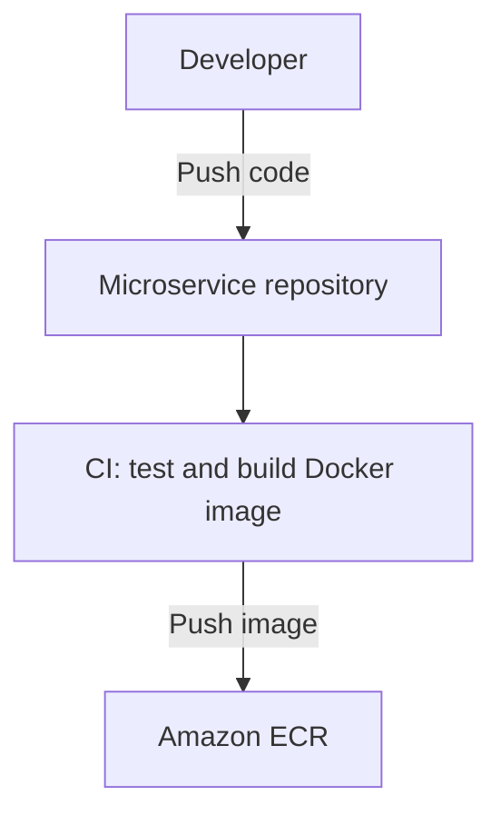
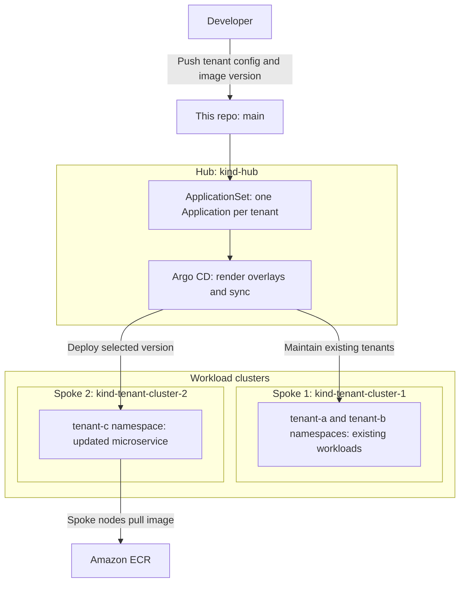

# Build an image, then deploy it to a tenant

Two Git changes take a microservice from code to a running tenant:

1. Push application code to build and publish an image.
2. Push tenant configuration to choose where that image runs.

This repo currently runs nginx on Kind using Argo CD and Kustomize. The CI
pipeline and ECR registry below are prerequisites, not things `setup.sh` creates.

## 1. Build and publish



CI publishes a version tied to the code commit, for example:

```text
123456789012.dkr.ecr.ap-south-1.amazonaws.com/orders:git-a1b2c3d4e5f6
```

Use your real account, region, repository, and tag. CI needs permission to
[push to ECR](https://docs.aws.amazon.com/AmazonECR/latest/userguide/docker-push-ecr-image.html).
Use [immutable tags](https://docs.aws.amazon.com/AmazonECR/latest/userguide/image-tag-mutability.html)
so the same version always refers to the same image.

Publishing an image does not deploy it. The next Git change selects that version
for a tenant.

## 2. Deploy to a tenant



Argo CD applies configuration; the spoke nodes pull and run the image.
In this example, only tenant-c gets the new version. Tenant-a and tenant-b
remain on spoke 1.

Before starting:

- Follow the [setup instructions](../README.md) and register spoke 2 with
  `./scripts/add-kind-spoke.sh tenant-cluster-2`.
- Publish an image compatible with the spoke nodes' CPU architecture.
- Give spoke nodes ECR pull access, separately from CI's push access.
  Keep credentials out of Git and arrange renewal: [ECR tokens expire after
  12 hours](https://docs.aws.amazon.com/AmazonECR/latest/userguide/registry_auth.html).
  Logging Docker in on your Mac does not configure Kind's nodes.
- Adapt the service's ports, probes, and runtime configuration. The demo
  expects HTTP on port 80 and a readiness endpoint at `/`.

### Choose where: tenant configuration

Set `tenants/tenant-c/config.json` to:

```json
{
  "tenant": "tenant-c",
  "namespace": "tenant-c",
  "clusterURL": "https://tenant-cluster-2-control-plane:6443",
  "clusterName": "kind-tenant-cluster-2"
}
```

`clusterURL` selects the registered cluster; `namespace` selects the tenant's
namespace. Keep the overlay namespace identical. `clusterName` is a label, not
the destination selector. This endpoint is specific to the local Kind demo.

### Choose what version: tenant overlay

Replace only the `images` section in `overlays/tenant-c/kustomization.yaml`:

```yaml
images:
  - name: nginx
    newName: 123456789012.dkr.ecr.ap-south-1.amazonaws.com/orders
    newTag: "git-a1b2c3d4e5f6"
```

Use your published ECR repository and tag. `name: nginx` matches the base image;
`newName` replaces it and `newTag` picks the version. Keep the rest of the overlay.
This replaces the demo container, rather than adding another microservice;
the Deployment and Service remain named `demo-app-tenant-c`.

### Render and push

Run from the repo root, review the rendered image and namespace, then commit:

```bash
kubectl kustomize overlays/tenant-c
git add tenants/tenant-c/config.json overlays/tenant-c/kustomization.yaml
# Also stage any supporting manifests you changed.
git diff --cached
git commit -m "deploy orders to tenant-c"
git push origin main
```

These commands assume you are on `main`. If using a pull request, merge it into
`main`: that is the branch Argo CD tracks. Argo CD discovers the change and syncs
automatically; deployment is not instantaneous.

## Verify

With the Argo CD CLI logged in and its port-forward running:

```bash
argocd app get tenant-c --refresh
argocd app wait tenant-c --sync --health --timeout 180
kubectl --context kind-tenant-cluster-2 -n tenant-c \
  rollout status deployment/demo-app-tenant-c --timeout=180s
kubectl --context kind-tenant-cluster-2 -n tenant-c get pods \
  -o custom-columns='NAME:.metadata.name,IMAGE:.spec.containers[*].image'
```

For a new tenant, allow time for its Application to appear. Check that Argo CD
shows the intended Git revision and the pods use the published image version;
a healthy old deployment does not confirm the update.
