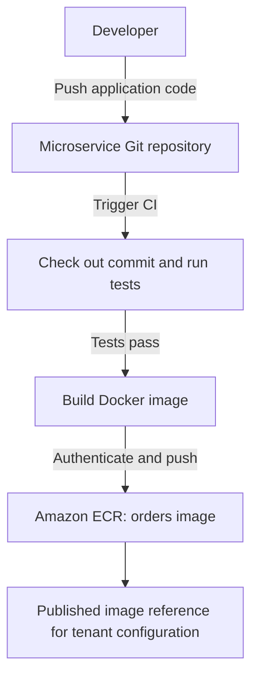
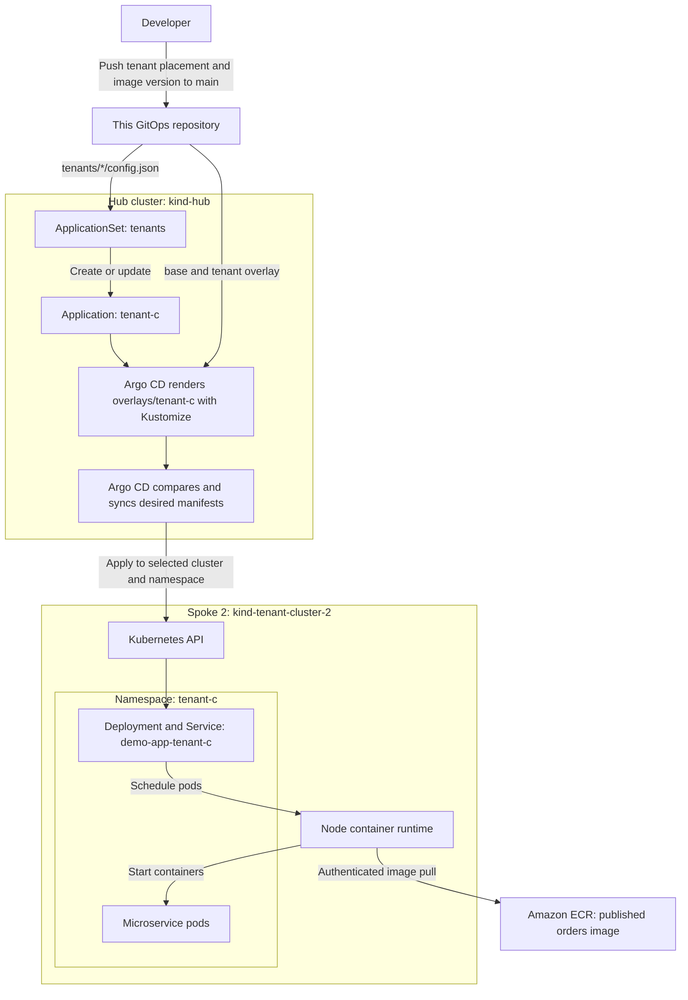

# From microservice code to a tenant deployment

There are two separate Git changes: one produces an image; the other chooses
where that image runs. The image reference connects the two workflows.

This repository currently deploys nginx using Kustomize on Kind spokes, with
Argo CD on the hub. The microservice CI pipeline and Amazon ECR setup below
describe how to extend that workflow; they are not provisioned by `setup.sh`.

## 1. Build and publish the microservice



The microservice repository contains the application code, Dockerfile, and CI
definition. CI builds a version tied to the source commit, for example:

```text
123456789012.dkr.ecr.ap-south-1.amazonaws.com/orders:git-a1b2c3d4e5f6
```

The account, region, repository, and tag here are examples. Use the actual
published reference when deploying. Configure [ECR tag immutability](https://docs.aws.amazon.com/AmazonECR/latest/userguide/image-tag-mutability.html) so a
commit-based tag cannot be overwritten; alternatively pin an image digest.
Build for the destination nodes' CPU architecture, or publish a multi-platform
image when needed.

CI needs AWS permissions to authenticate and push to the ECR repository.
Pre-create that repository for this workflow. AWS documents the
[ECR image push process](https://docs.aws.amazon.com/AmazonECR/latest/userguide/docker-push-ecr-image.html).

Publishing the image does **not** deploy it. This repo has no image updater or
CI automation that changes tenant image references after an ECR push. A failed
build or push should stop promotion to the next workflow.

## 2. Select a tenant and deploy the published version



The ApplicationSet reads tenant JSON files and creates or updates one
Application per tenant. Each Application tracks its overlay on `main`.
Changing an existing tenant's image requires only an overlay change, not a new
Application. See the [Argo CD Git file generator documentation](https://argo-cd.readthedocs.io/en/stable/operator-manual/applicationset/Generators-Git/).

### Prerequisites

- Bootstrap Argo CD and configure the ApplicationSet to read this repository.
- Register spoke 2 with `./scripts/add-kind-spoke.sh tenant-cluster-2`, as
  described in the [README](../README.md#3-add-the-second-spoke).
- Ensure the hub can reach the spoke API and the spoke nodes can reach ECR.
- Configure private image-pull authentication on the spokes. CI's push
  credentials and Argo CD's cluster credentials do not give nodes ECR access.
  On Kind, your Mac's `docker login` does not automatically configure the node
  container runtimes. Use an appropriate node credential mechanism or a
  namespace-local `imagePullSecret` referenced by the workload or ServiceAccount.
  ECR authorization tokens expire after 12 hours, so a one-time secret is not
  a durable solution; arrange renewal. Do not commit credentials to Git.
  See [ECR private registry authentication](https://docs.aws.amazon.com/AmazonECR/latest/userguide/registry_auth.html).

### Configure tenant-c on spoke 2

Set `tenants/tenant-c/config.json` to:

```json
{
  "tenant": "tenant-c",
  "namespace": "tenant-c",
  "clusterURL": "https://tenant-cluster-2-control-plane:6443",
  "clusterName": "kind-tenant-cluster-2"
}
```

| Setting | Role in this repository |
| --- | --- |
| `tenant` | Application name and overlay directory name |
| `namespace` | Destination namespace; keep the overlay namespace identical |
| `clusterURL` | Actual destination API endpoint; must match a registered cluster |
| `clusterName` | Descriptive Application label, not the destination selector |

The Docker-network endpoint above is specific to Kind. Use a hub-reachable
registered API endpoint for production clusters.

In `overlays/tenant-c/kustomization.yaml`, replace the existing `images` section
with the following example, substituting your real ECR repository and tag:

```yaml
images:
  - name: nginx
    newName: 123456789012.dkr.ecr.ap-south-1.amazonaws.com/orders
    newTag: "git-a1b2c3d4e5f6"
```

Keep the rest of the overlay, including its namespace, labels, resource-name
patches, and replica count. `name: nginx` matches the original image in this
repo's base Deployment; `newName` replaces its repository and `newTag` selects
the published version. These are [Kustomize image transformations](https://kubernetes.io/docs/tasks/manage-kubernetes-objects/kustomization/#images).
The tenant JSON does not contain the image version.

This example replaces the demo's single container with the orders service;
it does not add a second component. Resource names remain
`demo-app-tenant-c`. Before deploying a real microservice, adapt its ports,
Service target port, readiness probe, environment configuration, resources,
and image-pull configuration through appropriate manifests or overlay patches.
The current demo expects HTTP on port 80 with a readiness endpoint at `/`.

### Validate and push

From the repository root, render locally and check the destination namespace,
image reference, selectors, ports, and probes:

```bash
kubectl kustomize overlays/tenant-c

git add tenants/tenant-c/config.json overlays/tenant-c/kustomization.yaml
# Also stage any supporting manifests or patches you intentionally changed.
git diff --cached
git commit -m "deploy orders version git-a1b2c3d4e5f6 to tenant-c"
git push origin main
```

These commands assume you are working on `main`. If using a pull request,
merge it into `main` before expecting deployment: the ApplicationSet and
Applications in this repo track that branch.

Argo CD discovers Git changes during reconciliation; a push is not an
instantaneous deployment. This ApplicationSet enables automated sync, pruning,
self-healing, and namespace creation. Kubernetes then rolls out the Deployment,
and the **spoke's container runtime**, not Argo CD, pulls the image from ECR.

### Verify the rollout

With the Argo CD CLI logged in and its port-forward running:

```bash
argocd app get tenant-c --refresh
argocd app wait tenant-c --sync --health --timeout 180
kubectl --context kind-tenant-cluster-2 -n tenant-c \
  rollout status deployment/demo-app-tenant-c --timeout=180s
kubectl --context kind-tenant-cluster-2 -n tenant-c get pods \
  -o custom-columns='NAME:.metadata.name,IMAGE:.spec.containers[*].image,IMAGE_ID:.status.containerStatuses[*].imageID'
```

For a newly added tenant, wait for ApplicationSet discovery if the Application
does not exist yet. Confirm the Application's Git revision and image match
your intended change; a healthy previous version is not proof of this rollout.
If pods show `ImagePullBackOff`, inspect pod events and check the image
reference, registry connectivity, and pull authentication. If the destination
is unknown or unreachable, check spoke registration and `clusterURL`.

To roll back the image selection, revert the overlay version change in Git
and push to `main`. This does not undo database migrations or application data
changes; those need their own compatibility and recovery plan.
