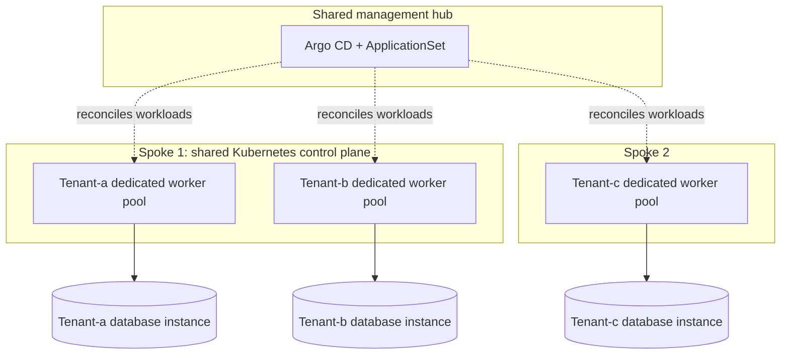

# Tenant isolation and performance acceptance testing

## Goal and current scope

The goal is predictable performance for every tenant, including when another
tenant generates excessive load. This document records a proposed production
direction, not infrastructure or tests already implemented in this repository.

The current demo deploys nginx applications into tenant namespaces on Kind
spokes, managed by Argo CD on a hub. It does not provision databases, dedicated
tenant node pools, or a performance-testing stack. All Kind clusters share the
local machine's resources, so they cannot establish production isolation guarantees.

## Management, workloads, and persistent data

Argo CD reconciles deployment configuration from Git. Tenant applications serve
traffic on the spokes; their databases and storage hold persistent data.
Application placement and database placement are separate decisions: an
application can move to another spoke while retaining an external database,
provided connectivity and access controls allow it.

Argo CD can manage database infrastructure manifests, but Git is not a backup
of database records. Persistent data needs its own lifecycle:

- Give each tenant restricted database credentials; keep migration privileges
  separate from normal application access.
- Run versioned schema migrations compatible with the tenant's application
  version, including any period when old and new application versions coexist.
- Define backups, retention, recovery objectives, and regularly tested restores.
- Make data deletion an explicit operation separate from ordinary application
  removal or replacement. Configure storage retention and deletion protection
  for the selected infrastructure.

The demo's teardown deletes Kind clusters and can destroy their local database
storage if databases are added. It must not be treated as a production data
retention mechanism.

## Database isolation choices

Access isolation controls who can read or modify data. Performance isolation
controls competition for resources. Failure isolation limits the effect of
outages and maintenance. These properties do not necessarily increase together.

| Strategy | Shared resources | Benefit | Remaining concern |
|---|---|---|---|
| Shared tables with `tenant_id` | Server, database, schema, tables | Efficient for many small tenants | Every access path must enforce tenant boundaries; resource contention and tenant-specific recovery remain difficult |
| Schema per tenant | Server and database | Separate tables and tenant-specific migrations | Schema permissions must enforce access; compute, storage, and server failures remain shared |
| Database per tenant | Database server | Separate credentials and logical database operations | CPU, memory, I/O, connections, and server failures remain shared |
| Database instance per tenant | Potentially underlying provider infrastructure | Independently sized capacity and maintenance | Higher cost and operational load; provider-level dependencies still exist |

For shared tables, PostgreSQL row-level security can reinforce application
filtering. Application roles must be restricted: superusers and `BYPASSRLS`
roles bypass row security, and table owners normally do as well. See
[PostgreSQL row security policies](https://www.postgresql.org/docs/current/ddl-rowsecurity.html).

Separate databases do not automatically provide separate point-in-time restores;
some services recover at instance scope. Verify the chosen service's recovery
granularity. Microsoft's [multitenant storage and data guidance](https://learn.microsoft.com/en-us/azure/architecture/guide/multitenant/approaches/storage-data)
discusses these sharing and operational tradeoffs.

## Proposed direction: capacity for every tenant

Start with dedicated database instances and dedicated application worker node
pools per tenant. A database service with enforceable per-tenant compute and
I/O allocations can also be considered, but separate logical databases alone
do not meet the performance-isolation objective.

Multiple tenants can share a spoke's Kubernetes control plane while running on
different worker nodes. Use enforced node affinity/selectors plus taints and
tolerations to keep workloads on their assigned pools and exclude other tenants.
Namespaces, resource requests, limits, and quotas complement this placement;
quotas alone do not isolate every shared resource, including network bandwidth.
See [Kubernetes multi-tenancy](https://kubernetes.io/docs/concepts/security/multi-tenancy/).

The database instances are external to the application worker pools in this
illustration. Every tenant receives capacity; this is not a premium-only tier.

| Layer | Per-tenant capacity or control |
|---|---|
| Application compute | Sized worker pool, baseline replicas, requests/limits, and scheduling enforcement |
| Database | Dedicated instance capacity, bounded connection pools, and query timeouts |
| Storage | IOPS and throughput budgets as well as capacity |
| Background jobs | Worker concurrency, queue bounds, and fair scheduling where services are shared |
| Incoming traffic | Rate and concurrency limits with defined rejection/queueing behavior |
| Shared dependencies | Capacity and fairness controls for ingress, caches, brokers, network paths, and downstream services |

Dedicated capacity reduces cross-tenant interference; it does not promise fixed
latency under unlimited load. Define the supported operations, dataset sizes,
request rates, burst duration, and background activity for each tenant. Provision
baseline capacity for that promise: autoscaling takes time and cannot replace it.

For illustration only, a target might be 100 requests/second per tenant with
p95 latency below 250 ms for a specified operation mix and dataset size.
Actual workload profiles and service-level objectives (SLOs) remain to be defined.

## Acceptance-testing tools

| Tool | Role |
|---|---|
| [k6](https://grafana.com/docs/k6/latest/using-k6/thresholds/) | Generate tenant-specific API traffic and enforce latency, error, and throughput criteria |
| [Prometheus](https://prometheus.io/docs/introduction/overview/) and [Grafana](https://prometheus.io/docs/visualization/grafana/) | Collect and visualize application, node, and database metrics to explain interference |
| [pgbench](https://www.postgresql.org/docs/current/pgbench.html) | Exercise PostgreSQL with transaction workloads and representative custom SQL scripts |
| [Chaos Mesh](https://chaos-mesh.org/docs/simulate-heavy-stress-on-kubernetes/) | Apply controlled CPU and memory stress to selected test containers |

Begin with k6 and observability, then add database and resource stress tests as
those components become available. k6 thresholds produce a nonzero exit code on
failure, allowing acceptance criteria to gate CI. Dashboards support diagnosis;
explicit assertions decide whether a test passes.

## Test procedure and acceptance criteria

Run tests in a designated test environment with representative infrastructure,
data volumes, and application operations. Use tenant-specific credentials and
record resource allocations, versions, and workload settings for reproducibility.

1. **Baseline:** After warm-up, drive every tenant at its agreed normal load and
   verify the SLOs are achievable before introducing interference.
2. **Interference:** Overload tenant-a while keeping tenant-b and tenant-c at
   their agreed loads. Evaluate their latency, errors, and achieved throughput.
3. **Recovery:** Return tenant-a to normal load and check that queues, latency,
   and resource consumption recover within the agreed window.
4. **Rotate and repeat:** Make each tenant the overloaded tenant. Test API floods,
   expensive database queries, background jobs, and storage-intensive operations
   separately before combining them.

Tag measurements by tenant, operation, and phase. Evaluate the interference
phase separately so a long healthy baseline cannot hide a short degradation.
k6 supports [tags and groups](https://grafana.com/docs/k6/latest/using-k6/tags-and-groups/)
and thresholds scoped to tagged metrics.

Illustrative criteria for each unaffected tenant during interference:

- p95 response time below 250 ms and failed requests below 0.1%.
- Agreed throughput achieved, with no unaccounted dropped load-generator iterations.
- Degradation from baseline below an agreed tolerance.
- No unexpected pod restarts, connection exhaustion, or persistent queue growth.

Also assert that the overloaded tenant receives the intended throttling or
bounded queueing behavior. Define thresholds, observation windows, recovery
limits, and acceptable variability before using the results as an acceptance gate.

Observe CPU utilization and throttling, memory and restarts, database connections
and lock waits, storage latency/throughput, and network saturation. Monitor the
load generators too: exhausted generators can silently reduce offered load and
produce misleading results. Retain per-phase results and correlated metrics.

The current nginx welcome page is sufficient to demonstrate HTTP load testing,
but it does not exercise database isolation. Add representative application
reads and writes before drawing conclusions about the persistent data plane.
For production acceptance, use separate load-generator capacity and the real
ingress path. Port-forwarding and Kind on a shared laptop can introduce their
own bottlenecks and cannot validate production performance guarantees.
